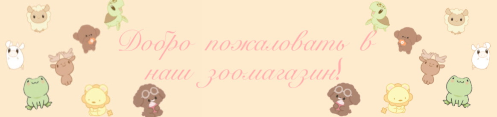
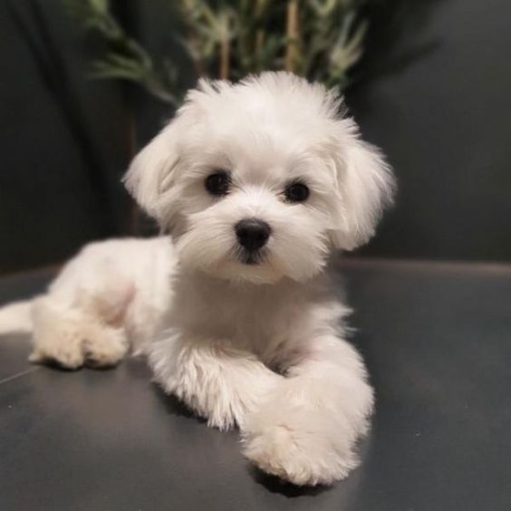
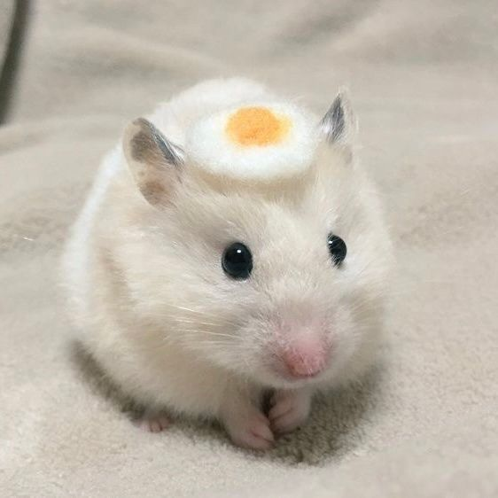
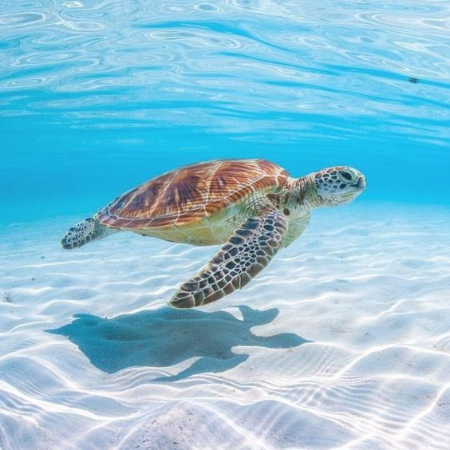

<!DOCTYPE html>
<head>
    <title>Зоомагазин "Все для питомцев"</title>
    <link  href="style.css" rel="stylesheet" type="text/css">
    
    <link rel="stylesheet" href="https://cdn.jsdelivr.net/npm/tooltipster/dist/css/tooltipster.bundle.min.css">
    
    

    
</head>
<body bgcolor="#f8f0e3" text="#333333">
    <nav>
        

            <table id="ani" width="100%" border="1" cellpadding="10">
                <tr>
                    <td><a href="#cats">Товары для кошек</a></td>
                    <td><a href="#dogs">Товары для собак</a></td>
                    <td><a href="#birds">Товары для птиц</a></td>
                    <td><a href="#animals">Другие животные</a></td>
                    <td><a href="#contacts">Контакты</a></td>
                </tr>
            </table>
        

        <button id="change-font">Изменить шрифт</button>
        </nav>
        <svg width="800" height="400">
            <circle cx="750" cy="100" r="30" fill="yellow">
                <animate 
                    attributeName="r" 
                    from="30" 
                    to="40" 
                    dur="2s" 
                    begin="0s; s.end" 
                    fill="freeze" 
                    id="g" />
                <animate 
                    attributeName="r" 
                    from="40" 
                    to="30" 
                    dur="2s" 
                    begin="g.end" 
                    fill="freeze" 
                    id="s" />
            </circle>
        </svg>
        <canvas id="canvas" width="1500" height="400"></canvas>
    <header id="head">
        <table width="100%" border="0" bgcolor="#ffebcd" cellpadding="10">
            <tr>
                <td align="center">
                    <h1>Зоомагазин "Все для питомцев"</h1>
                    
                    
<strong>Мы заботимся о ваших любимцах!</strong>

                </td>
            </tr>
        </table>
    </header>
    <section id="cats">
        

            <table id="mysyk" width="100%" border="0" cellpadding="10">
                <tr>
                    <td align="center" bgcolor="#faf0e6">
                        <h2 class="tov" id="mys">Товары для кошек</h2>
                        
                        
                        <ul id="catItems">
                            <li>Корм для кошек: <strong>от 1500 тг.</strong></li>
                            <li>Игрушки для кошек: <strong>от 1000 тг.</strong></li>
                            <li>Когтеточки: <strong>от 1500 тг.</strong></li>
                        </ul>
                        <button onclick="sor()">Сортировать товары</button>
                        <h2>Хотите добавить товар?</h2> 
                        <button onclick="kos()">Добавить товар</button>
                        
                    </td>
                </tr>
            </table>
        

    </section>
    <section id="dogs">
        

            <table width="100%" border="0" cellpadding="10">
                <tr>
                    <td align="center" bgcolor="#faf0e6">
                        <h2 class="tov">Товары для собак</h2>
                        
                        <ul>
                            <li><a href="file:///C:/Users/user/Desktop/1%20%D1%81%D0%B5%D0%BC/html/%D0%BA%D0%BE%D1%80%D0%BC%D0%B0.html">Корм для собак: </a><strong>от 2000 тг.</strong></li>
                            <li><a href="file:///C:/Users/user/Desktop/1%20%D1%81%D0%B5%D0%BC/html/toy.html">Игрушки для собак: </a><strong>от 1400 тг.</strong></li>
                            <li><a href="file:///C:/Users/user/Desktop/1%20%D1%81%D0%B5%D0%BC/html/acc.html">Поводки и ошейники: </a><strong>от 3000 тг.</strong></li>
                        </ul>
                        <button @click="chooseProduct">Выбор товара</button>
                    </td>
                </tr>
            </table>
        

    </section>   
    <section id="birds">
        
 
            <table width="100%" border="0" cellpadding="10">
                <tr>
                    <td align="center" bgcolor="#faf0e6">
                        <h2 class="tov">Товары для птиц</h2>
                        
                        <button id="add">Добавить элемент</button>
                        <button id="removen">Удалить элемент</button>
                        <ul>
                            <li><a href="file:///C:/Users/user/Desktop/1%20%D1%81%D0%B5%D0%BC/html/acc.html">Клетки для птиц: </a><strong>от 8000 тг.</strong></li>
                            <li><a href="file:///C:/Users/user/Desktop/1%20%D1%81%D0%B5%D0%BC/html/%D0%BA%D0%BE%D1%80%D0%BC%D0%B0.html">Корм для птиц: </a><strong>от 1000 тг.</strong></li>
                            <li><a href="file:///C:/Users/user/Desktop/1%20%D1%81%D0%B5%D0%BC/html/toy.html">Игрушки для птиц:</a><strong>от 800 тг.</strong></li>
                        </ul>
                    </td>
                </tr>
            </table>
        

    </section>
    <section id="animals">
        

            <table id="tab" width="100%" border="0" cellpadding="10">
                <tr>
                    <td align="center" bgcolor="#faf0e6">
                        <h2>Товары для других животных</h2>
                        <table>
                            <tr>
                                <td>
                                    <h3>1. Кролики</h3>
                                
                                
Корм, клетки и игрушки для кроликов

                            </td>
                            <td>
                                <h3>2. Хомяки</h3>
                                
                                
Корм, клетки и игрушки для хомяков

                            </td>
                            <td>
                            <h3>3. Морские свинки</h3>
                            
                            
Корм и аксессуары для морских свинок

                            </td>
                            </tr>
                            <tr>
                            <td>
                            <h3>4. Черепахи</h3>
                            
                            
Аквариумы и корм для черепах

                            </td>
                            <td>
                            <h3>5. Ящерицы</h3>
                            
                            
Террариумы и корм для ящериц

                            </td>
                            <td>
                            <h3>6. Змеи</h3>
                            
                            
Террариумы и корм для змей

                            </td>
                            </tr>
                            <tr>
                            <td>
                            <h3>7. Рыбы</h3>
                            
                            
Аквариумы и корм для рыб

                            </td>
                            <td>
                            <h3>8. Фретки</h3>
                            
                            
Корм и аксессуары для фреток

                            </td>
                            <td>
                            <h3>9. Лягушки</h3>
                            
                            
Террариумы и аксессуары для лягушек

                            </td>
                            </tr>
                            <tr>
                            <td>
                            <iframe name="i" src="file:///C:/Users/user/Desktop/1%20%D1%81%D0%B5%D0%BC/html/%D0%BA%D0%BE%D1%80%D0%BC%D0%B0.html" width="400" height="200"></iframe></td>
                            <td>
                            <iframe name="in" src="file:///C:/Users/user/Desktop/1%20%D1%81%D0%B5%D0%BC/html/toy.html" width="400" height="200"></iframe></td>
                            <td>
                            <iframe name="inf" src="file:///C:/Users/user/Desktop/1%20%D1%81%D0%B5%D0%BC/html/acc.html" width="400" height="200"></iframe></td>
                            </tr>
                        </table>
                    </td>
                </tr>
            </table>
        

    </section>
    <canvas id="canvas" width="800" height="400" align="center"></canvas>
    <table width="100%" border="1" cellpadding="10" bgcolor="#ffe4e1">
        <tr>
            <td align="center">
                <h2 id="contacts">Контакты</h2>
                
Адрес: ул. Жибек жолы, 12, г. Усть-Каменогорск

                
Телефон: +7 771 133 1348

                
Email: zoomagazin@mail.ru

            </td>
        </tr>
    </table>
    <h2 align="center">Закажите товары для ваших питомцев</h2>

<form id="orderForm" action="#" method="post" align="center">
    <label for="type">Тип животного:</label> 
    <select id="type" name="type" required>
        <option value="cat">Кошка</option>
        <option value="dog">Собака</option>
        <option value="bird">Птица</option>
        <option value="hamster">Хомяк</option>
        <option value="rabbit">Кролик</option>
        <option value="fish">Рыба</option>
        <option value="reptile">Рептилия</option>
        <option value="snake">Змея</option>
        <option value="ferret">Фретка</option>
        <option value="guinea_pig">Морская свинка</option>
    </select>
      

    <label for="produc">Выберите товар:</label> 
    <input type="text" id="product" name="product" placeholder="Название товара" required>
      

    <label for="quantity">Количество:</label> 
    <input type="number" id="quantity" min="1" placeholder="1" required>
      

    <label for="address">Адрес доставки:</label> 
    <input type="text" id="address" placeholder="Улица, дом, квартира" required>
      

    <label for="phone">Контактный телефон:</label> 
    <input type="tel" id="phone" placeholder="+7 (_) _-__" required>
      

    <label for="comments">Дополнительные комментарии:</label> 
    <textarea rows="2" cols="25" placeholder="Дополнительная информация..."></textarea>
      
    <button type="button" onclick="showMessage()">Оформить заказ</button>
    <button id="fadeOut">Скрыть</button>
</form>

    <button @click="toggle">Показать/Скрыть блок</button>
    

        <button onclick="UserAgent()">Показать User Agent</button>
        <button onclick="Platform()">Показать платформу</button>
        <button onclick="ScreenInfo()">Информация о экране</button>
        <button onclick="Locations()">Показать URL</button>
        <button onclick="Frames()">Показать количество фреймов</button>
    

    <h2>Хотите добавить отзыв?</h2>
    <input v-model="newTask" placeholder="Отзывы о сайте">
    <button @click="addTask">Оставить отзыв</button>
    <ul>
        <li v-for="(task, index) in tasks" :key="index">
            {{ task }} 
            <button @click="removeTask(index)" style="margin-left: 10px;">Удалить</button>
        </li>
    </ul>

</body>
</html>
